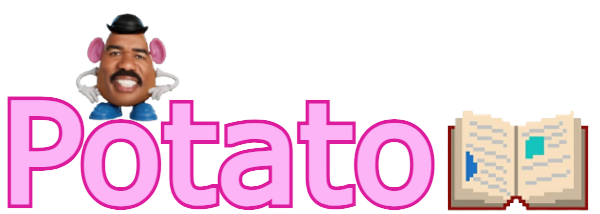

  
# Potato Visual Novel Framework  
  
Potato is a simple visual novel framework written in C++ using the SDL framework. It is designed such that only a basic and fundamental grasp of C++ is required to produce a complete visual novel game from start to finish. No additional module/library installation is required, as all the essential files are already included.  
  
Big thanks to [chen e](https://github.com/56cy) for helping with the SDL setup.  
Extra thanks to [zhogrog](https://github.com/GaoZR2008) for christening this.  

Check out the [Shrek dating simulator](https://github.com/WAP-Industries/Potato-Shrek-Dating-Sim) made using this framework.

---

## Requirements
1. GNU g++ (update to the latest version)
2. Python 3.11 or higher (idk as long as it has the json module)
3. The blood of an infant
---

## Project setup
To create a new Potato project:
1. Clone and rename the folder if needed
2. Run the `build.bat` file located in the root directory
3. Enter a project name when prompted, and a `compile.ps1` and `.cpp` file will be generated  
  
A complete Potato project folder will be structured as such (excluding all non-essential files).
```
[Root Directory]/
    |
    ├── .cpp project file
    |
    ├── .exe game file (generated on compilation)
    |
    ├── SDL .dll files
    |
    ├── SDL2/
    |   └── SDL .h files
    |
    ├── lib/
    |   └── SDL libraries
    |
    ├── default/
    |   ├── default framework settings
    |   └── default framework assets
    |
    ├── src/
    |   └── framework source files
    |
    ├── Potato.hpp (main framework file, include in project file)
    |
    ├── build.bat (sets up project folder)
    |
    └── compile.ps1 (compiles and runs project)
```
---

## Compilation
To compile and run your Potato project:
1. Open up Windows PowerShell or the VSCode PowerShell terminal
2. `cd` to your project folder
3. Enter `& .\compile.ps1`
